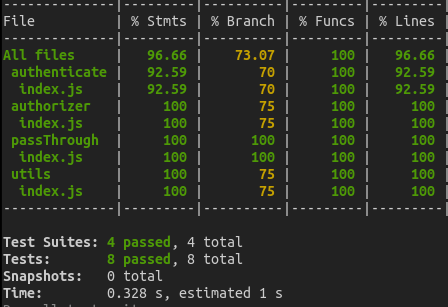
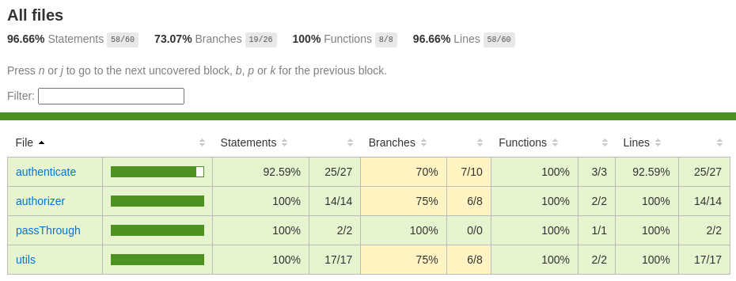

[](https://registry.terraform.io/modules/seu-nome-de-usuario/seu-modulo)
[](https://aws.amazon.com/)
[](https://www.serverless.com/)


# Tech Challenge - Fase 03 (GRUPO 31) - AWS Api Gateway && Lambdas

Este repositório o terraform + aplicação para criação dos seguintes itens:

* 1 API Gateway endpoint
* 1 Lambda Autentication
* 1 Lambda Authorizer

## Requisitos

* [Terraform](https://www.terraform.io/) - Terraform is an open-source infrastructure as code software tool that provides a consistent CLI workflow to manage hundreds of cloud services. Terraform codifies cloud APIs into declarative configuration files.
* [Amazon AWS Account](https://aws.amazon.com/it/console/) - Amazon AWS account with billing enabled
* [aws cli](https://aws.amazon.com/cli/) optional
* [Serverless Framework](https://www.serverless.com/) - The Serverless Framework is an open-source application framework for building and deploying serverless applications. It provides a simple, intuitive way to define serverless resources and manage deployments.

## Execução dos testes unitários

- npm run test



Coverage




## Jornada de teste

Autenticar um cpf para gerar o JWT
```
curl --location 'http://[API_GATEWAY]/authenticate' \
--header 'Content-Type: application/json' \
--data '{
    "_cpf": "00000000000"
}'

```

## Antes de começar

Esta execução esta fora do nível gratuito da AWS, importante avaliar antes de executar

## AWS configuração

Com os requisitos já identificados, configure abaixo no secrets do github.

```
AWS_ACCESS_KEY = "xxxxxxxxxxxxxxxxx"
AWS_SECRET_KEY = "xxxxxxxxxxxxxxxxx"
```


## Jornada de teste

Autenticar um cpf para gerar o JWT
```
curl --location 'http://[API_GATEWAY]/authenticate' \
--header 'Content-Type: application/json' \
--data '{
    "_cpf": "00000000000"
}'

```

Nas proximas requisições da aplicação utilizar Authentication Bearer: JWT

## AWS configuração

Com os requisitos já identificados, configure abaixo no secrets do github.

```
AWS_ACCESS_KEY = "xxxxxxxxxxxxxxxxx"
AWS_SECRET_KEY = "xxxxxxxxxxxxxxxxx"
SONAR_HOST_URL = "xxxxxxxxxxxxxxxxx"
SONAR_TOKEN    = "xxxxxxxxxxxxxxxxx"
```

## Uso

Com os requisitos já identificados, as variáveis configuradas no secrets do github.

Efetue o Pull Request com a branch master para executar o processo de

- Teste
- Sonarqube
- Deploy

### Execução do projeto

Ao efetuar um push no repositório develop com sucesso, é necessário efetuar um pull request na branch master para que a execução do pipeline do workflow seja executado
